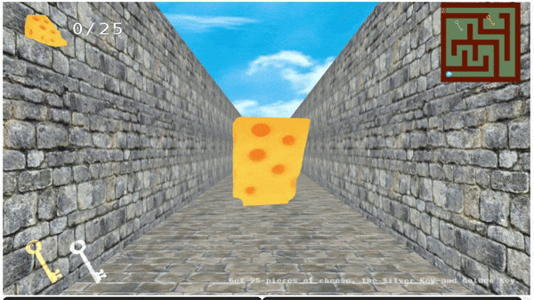

# Hungry Mouse 🐭
**To win the game:**
Collect 25 pieces of cheese.
Collect Both the Golden and Silver Keys.
Exit the gate in 3 minutes.

## Description
🪄 Boom! You have just become a mouse! 🐭 And you are hungry for cheese! 

🧀 Collect cheese and exit the maze within 3 minutes! Be sure to collect at least 25 pieces of cheese, and grab both the silver key and the golden key. 

Cheese Count is shown at the top left corner of the screen. 

✨ Good luck!

## Controls
[Arrowup] Move forward

[Arrowdown] Move backward

[Arrowleft] Turn to the left

[Arrowright] Turn to the right

## How to Run Hungry Mouse on Your Computer
### Step 1: Download:
Download Hungry Mouse, including all the sub-directories. Unzip all the files, if the downloaded file is zipped.

## Step 2: Run and modify your project:
1. Go to the folder where you downloaded Hungry Mouse. You should see the file `index.html` in your folder. Double-click and open it. In most cases, you can only see a blank page with title Tiny Graphics. 

2. Open the file `host` - `host.bat` if you're Windows, `host.command` if you're Mac. On Windows, you can just double click the file open.
- Python is required for the fake server.
- On Mac, you might get a security warning instead if you double-click. Instead, right click the files, then choose Open, or you can go into System Preferences/Security & Privacy/General and click 'Open Anyway'. You may possibly need to check the file permissions and set them to 744.
- You can also consider open a terminal at this folder and run `python server.py`

3. Look in the resulting console window. If you can't find a message starting with
on `Serving HTTP on...`

4. Now you're hosting. Keep that window open.

5. Open a new window of Google Chrome. Navigate Chrome to the url http://localhost:8000/ It should show the starting page of Hungry Mouse.

### Our Team
Yuntong Ju

Yaolan Luo

